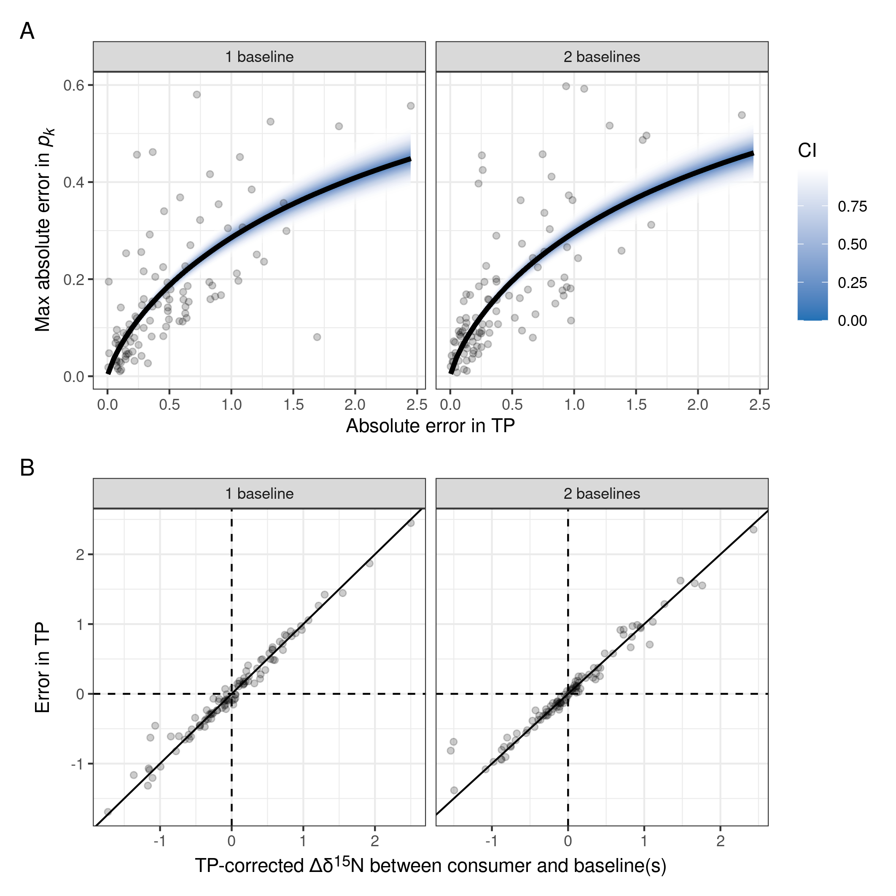
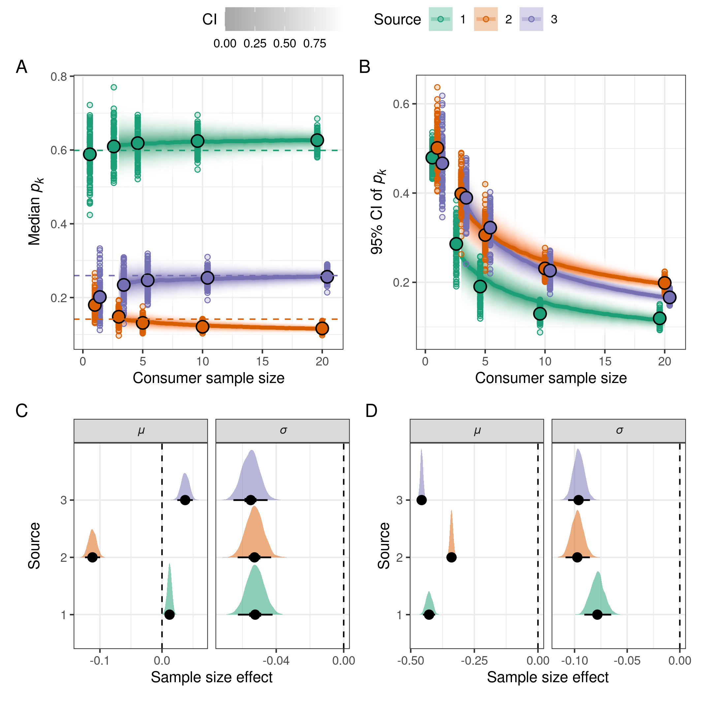
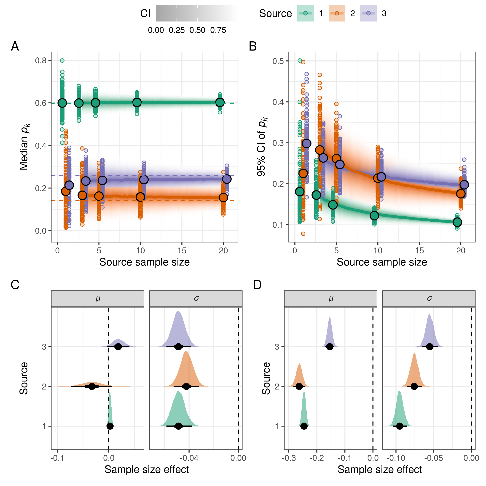

<!-- README.md is generated from README.Rmd. Please edit that file -->

# SIMMmultitroph_simulations

<!-- badges: start -->

<!-- badges: end -->

The goal of this project is to reproduce all results and figures of the
simulations in the paper

> TITLE AND AUTHORS
> <!-- > Title: Best practices for estimating consumer reliance on basal food sources with bulk stable isotopes -->
> <!-- > -->
> <!-- > Authors: Ghilardi M, Morais RA, Brandl SJ, Casey JM, Mercière A, Morat F, Schiettekatte NMD, Kayal M, Letourneur Y, Parravicini V -->

## Instructions

The project uses `targets` as pipeline tool to manage the entire project
workflow, `renv` for package management and `crew` for parallel
computing. It depends on R version 4.4.2 (2024-10-31), JAGS version
4.3.2, which is used to fit Bayesian mixing models, and CmdStan version
2.35.0, which is used to fit Bayesian regression models with `brms`.

> \[!NOTE\] If JAGS is not installed on the machine, you can install it
> from <https://mcmc-jags.sourceforge.io/>.

> \[!CAUTION\] The project takes several hours to run using parallel
> computing. It was run on a machine with 20 cores and a minimum of 12
> cores are required.
>
> To test whether the project is running correctly, it is recommended to
> modify `.targets.R` by reducing the number of simulations from 100 to
> 10 on line 26 (variable `nrep`) and the number of iterations of
> Bayesian mixing models by replacing `run = "short"` with
> `run = "test"` on lines 34, 61, and 82.

To reproduce the project:

1.  Open the R project in RStudio or open an R session with working
    directory set to the root of the project.
2.  Install the required R packages by calling:

``` r
renv::restore()
```

3.  Check the installed version of CmdStan by calling:

``` r
cmdstanr::cmdstan_version()
```

> \[!NOTE\] If CmdStan is not installed on the machine, you can install
> it by calling:
>
> ``` r
> CmdStanR::install_cmdstan(version = "`r cmdstanr::cmdstan_version()`")
> ```
>
> as explained at <https://mc-stan.org/cmdstanr/articles/cmdstanr.html>.

4.  Run the pipeline by calling:

``` r
targets::tar_make()
```

5.  Save the plots by calling:

``` r
source(save_figures.R)
```

Alternatively directly visualise the plots by reading individual
targets:

``` r
library(ggplot2)

# Figure 2
targets::tar_read(plot_pk_vs_tp)
```



``` r
# Figure 3
targets::tar_read(plot_sample_size_consumer)
```



``` r
# Figure 4
targets::tar_read(plot_sample_size_source)
```



## Content

This repository is structured as follow:

- [:file_folder:
  figures/](https://github.com/mattiaghilardi/SIMMmultitroph_simulations/tree/master/figures):
  contains all the figures created by the pipeline and saved with the
  script
  [save_figures.R](https://github.com/mattiaghilardi/SIMMmultitroph_simulations/blob/master/save_figures.R).

- [:file_folder:
  R/](https://github.com/mattiaghilardi/SIMMmultitroph_simulations/tree/master/R):
  contains R functions.

- [:page_facing_up:
  \_targets.R](https://github.com/mattiaghilardi/SIMMmultitroph_simulations/blob/master/_targets.R):
  project pipeline.

- [:page_facing_up:
  save_figures.R](https://github.com/mattiaghilardi/SIMMmultitroph_simulations/blob/master/save_figures.R):
  script to save figures.

- [:page_facing_up:
  \_targets_packages.R](https://github.com/mattiaghilardi/SIMMmultitroph_simulations/blob/master/_targets_packages.R):
  list of package dependencies created by `targets::tar_renv()` for
  compatibility with `renv`.

- [:page_facing_up:
  .Rprofile](https://github.com/mattiaghilardi/SIMMmultitroph_simulations/blob/master/.Rprofile):
  script to activate `renv` that is automatically executed every time an
  R session starts.

- [:page_facing_up:
  renv.lock](https://github.com/mattiaghilardi/SIMMmultitroph_simulations/blob/master/renv.lock):
  file that records the library used to run the project and makes it
  easier to reinstall it in the future and on different machines.

- [:page_facing_up:
  SIMMmultitroph_simulations.Rproj](https://github.com/mattiaghilardi/SIMMmultitroph_simulations/blob/master/SIMMmultitroph_simulations.Rproj):
  project file used by RStudio to define and manage the R project. Can
  be used as a shortcut for opening the project directly from the
  filesystem.

## Dependency network

The following graph shows the dependency network of the project:

``` mermaid
graph LR
  style Legend fill:#FFFFFF00,stroke:#000000;
  style Graph fill:#FFFFFF00,stroke:#000000;
  subgraph Legend
    direction LR
    x7420bd9270f8d27d([""Up to date""]):::uptodate --- xbf4603d6c2c2ad6b([""Stem""]):::none
    xbf4603d6c2c2ad6b([""Stem""]):::none --- xf0bce276fe2b9d3e>""Function""]:::none
    xf0bce276fe2b9d3e>""Function""]:::none --- x5bffbffeae195fc9{{""Object""}}:::none
  end
  subgraph Graph
    direction LR
    xf48d3b6327a7cf5e>"run_model_parallel"]:::uptodate --> x28f1d3113c9459b8>"run_simulations_baselines"]:::uptodate
    xf48d3b6327a7cf5e>"run_model_parallel"]:::uptodate --> x47a8a2aae50632f3>"run_simulations_source_sample_size"]:::uptodate
    xf48d3b6327a7cf5e>"run_model_parallel"]:::uptodate --> x6db4d56f639e323d>"run_simulations_consumer_sample_size"]:::uptodate
    x591bcbf82eb648c3>"simulate_food_web"]:::uptodate --> x28f1d3113c9459b8>"run_simulations_baselines"]:::uptodate
    xc69bd914436bb0ef>"simulate_consumer_data"]:::uptodate --> x591bcbf82eb648c3>"simulate_food_web"]:::uptodate
    xc69bd914436bb0ef>"simulate_consumer_data"]:::uptodate --> x6db4d56f639e323d>"run_simulations_consumer_sample_size"]:::uptodate
    x21ac55773aa00ff7>"estimate_tp_error"]:::uptodate --> x89aa6a1b0bb00997>"get_tp_error"]:::uptodate
    x6d92743533cfd8a6>"rescale_dirichlet"]:::uptodate --> x591bcbf82eb648c3>"simulate_food_web"]:::uptodate
    x89aa6a1b0bb00997>"get_tp_error"]:::uptodate --> xc786b5ea9d63b9c5>"plot_TP_error_effect"]:::uptodate
    x947713c23b367de6>"get_baseline_contrasts"]:::uptodate --> x7c75abec967e9944(["baseline_contrasts"]):::uptodate
    x8effdbfc4054a8b1(["model_baseline"]):::uptodate --> x7c75abec967e9944(["baseline_contrasts"]):::uptodate
    x692c828a4b14e9e4>"get_slopes"]:::uptodate --> x407f420266f7cba3(["slopes_median_sample_size_consumer"]):::uptodate
    x43d5dd88718ec163(["model_median_sample_size_consumer"]):::uptodate --> x407f420266f7cba3(["slopes_median_sample_size_consumer"]):::uptodate
    xb36606d044598292{{"nrep"}}:::uptodate --> xeed5bb8f0b7988df(["sim_sample_size_source"]):::uptodate
    x47a8a2aae50632f3>"run_simulations_source_sample_size"]:::uptodate --> xeed5bb8f0b7988df(["sim_sample_size_source"]):::uptodate
    xedfdc913389bf9d2(["sim_food_web"]):::uptodate --> xeed5bb8f0b7988df(["sim_sample_size_source"]):::uptodate
    xe296b01090e4e986(["model_CI_sample_size_source"]):::uptodate --> x1606860f46586235(["plot_sample_size_source"]):::uptodate
    x94cc20dcbe89a450(["model_median_sample_size_source"]):::uptodate --> x1606860f46586235(["plot_sample_size_source"]):::uptodate
    x078b6b9033d458ed>"plot_sample_size_effect"]:::uptodate --> x1606860f46586235(["plot_sample_size_source"]):::uptodate
    xedfdc913389bf9d2(["sim_food_web"]):::uptodate --> x1606860f46586235(["plot_sample_size_source"]):::uptodate
    xeed5bb8f0b7988df(["sim_sample_size_source"]):::uptodate --> x1606860f46586235(["plot_sample_size_source"]):::uptodate
    x739b3428d6a79fd4(["slopes_CI_sample_size_source"]):::uptodate --> x1606860f46586235(["plot_sample_size_source"]):::uptodate
    xdc6d71eefa059099(["slopes_median_sample_size_source"]):::uptodate --> x1606860f46586235(["plot_sample_size_source"]):::uptodate
    x692c828a4b14e9e4>"get_slopes"]:::uptodate --> xad49654a44770e0a(["slopes_CI_sample_size_consumer"]):::uptodate
    x624dfa16887e8437(["model_CI_sample_size_consumer"]):::uptodate --> xad49654a44770e0a(["slopes_CI_sample_size_consumer"]):::uptodate
    xd40414fd87cf9ff3>"fit_sample_size_effect"]:::uptodate --> x624dfa16887e8437(["model_CI_sample_size_consumer"]):::uptodate
    x9ebeb9a32f4fbe45(["sim_sample_size_consumer"]):::uptodate --> x624dfa16887e8437(["model_CI_sample_size_consumer"]):::uptodate
    xb36606d044598292{{"nrep"}}:::uptodate --> x9ebeb9a32f4fbe45(["sim_sample_size_consumer"]):::uptodate
    x6db4d56f639e323d>"run_simulations_consumer_sample_size"]:::uptodate --> x9ebeb9a32f4fbe45(["sim_sample_size_consumer"]):::uptodate
    xedfdc913389bf9d2(["sim_food_web"]):::uptodate --> x9ebeb9a32f4fbe45(["sim_sample_size_consumer"]):::uptodate
    x692c828a4b14e9e4>"get_slopes"]:::uptodate --> xdc6d71eefa059099(["slopes_median_sample_size_source"]):::uptodate
    x94cc20dcbe89a450(["model_median_sample_size_source"]):::uptodate --> xdc6d71eefa059099(["slopes_median_sample_size_source"]):::uptodate
    x5a1e27704096b922>"fit_baseline_effect"]:::uptodate --> x8effdbfc4054a8b1(["model_baseline"]):::uptodate
    x6721637a114517cc(["performance_pk"]):::uptodate --> x8effdbfc4054a8b1(["model_baseline"]):::uptodate
    xddd15c1e29dd0db2(["performance_TP"]):::uptodate --> x8effdbfc4054a8b1(["model_baseline"]):::uptodate
    xd40414fd87cf9ff3>"fit_sample_size_effect"]:::uptodate --> xe296b01090e4e986(["model_CI_sample_size_source"]):::uptodate
    xeed5bb8f0b7988df(["sim_sample_size_source"]):::uptodate --> xe296b01090e4e986(["model_CI_sample_size_source"]):::uptodate
    x337dfe47aaaeaa92>"get_performance_TP"]:::uptodate --> xddd15c1e29dd0db2(["performance_TP"]):::uptodate
    xb36606d044598292{{"nrep"}}:::uptodate --> xddd15c1e29dd0db2(["performance_TP"]):::uptodate
    x5731469b81dfc1b5(["sim_baselines"]):::uptodate --> xddd15c1e29dd0db2(["performance_TP"]):::uptodate
    x7c75abec967e9944(["baseline_contrasts"]):::uptodate --> x896d952401a6da81(["plot_baseline"]):::uptodate
    x8effdbfc4054a8b1(["model_baseline"]):::uptodate --> x896d952401a6da81(["plot_baseline"]):::uptodate
    x6721637a114517cc(["performance_pk"]):::uptodate --> x896d952401a6da81(["plot_baseline"]):::uptodate
    xddd15c1e29dd0db2(["performance_TP"]):::uptodate --> x896d952401a6da81(["plot_baseline"]):::uptodate
    x1cf86ed3003212ac>"plot_baseline_effect"]:::uptodate --> x896d952401a6da81(["plot_baseline"]):::uptodate
    x38ddd0f39dee6000>"get_performance_pk"]:::uptodate --> x6721637a114517cc(["performance_pk"]):::uptodate
    xb36606d044598292{{"nrep"}}:::uptodate --> x6721637a114517cc(["performance_pk"]):::uptodate
    x5731469b81dfc1b5(["sim_baselines"]):::uptodate --> x6721637a114517cc(["performance_pk"]):::uptodate
    x8effdbfc4054a8b1(["model_baseline"]):::uptodate --> xb915cef9f481fc1f(["plot_pk_vs_tp"]):::uptodate
    x6721637a114517cc(["performance_pk"]):::uptodate --> xb915cef9f481fc1f(["plot_pk_vs_tp"]):::uptodate
    xddd15c1e29dd0db2(["performance_TP"]):::uptodate --> xb915cef9f481fc1f(["plot_pk_vs_tp"]):::uptodate
    xc786b5ea9d63b9c5>"plot_TP_error_effect"]:::uptodate --> xb915cef9f481fc1f(["plot_pk_vs_tp"]):::uptodate
    x5731469b81dfc1b5(["sim_baselines"]):::uptodate --> xb915cef9f481fc1f(["plot_pk_vs_tp"]):::uptodate
    xd40414fd87cf9ff3>"fit_sample_size_effect"]:::uptodate --> x94cc20dcbe89a450(["model_median_sample_size_source"]):::uptodate
    xeed5bb8f0b7988df(["sim_sample_size_source"]):::uptodate --> x94cc20dcbe89a450(["model_median_sample_size_source"]):::uptodate
    x692c828a4b14e9e4>"get_slopes"]:::uptodate --> x739b3428d6a79fd4(["slopes_CI_sample_size_source"]):::uptodate
    xe296b01090e4e986(["model_CI_sample_size_source"]):::uptodate --> x739b3428d6a79fd4(["slopes_CI_sample_size_source"]):::uptodate
    x591bcbf82eb648c3>"simulate_food_web"]:::uptodate --> xedfdc913389bf9d2(["sim_food_web"]):::uptodate
    xb36606d044598292{{"nrep"}}:::uptodate --> x5731469b81dfc1b5(["sim_baselines"]):::uptodate
    x28f1d3113c9459b8>"run_simulations_baselines"]:::uptodate --> x5731469b81dfc1b5(["sim_baselines"]):::uptodate
    x624dfa16887e8437(["model_CI_sample_size_consumer"]):::uptodate --> x1fc30f50d0051e95(["plot_sample_size_consumer"]):::uptodate
    x43d5dd88718ec163(["model_median_sample_size_consumer"]):::uptodate --> x1fc30f50d0051e95(["plot_sample_size_consumer"]):::uptodate
    x078b6b9033d458ed>"plot_sample_size_effect"]:::uptodate --> x1fc30f50d0051e95(["plot_sample_size_consumer"]):::uptodate
    xedfdc913389bf9d2(["sim_food_web"]):::uptodate --> x1fc30f50d0051e95(["plot_sample_size_consumer"]):::uptodate
    x9ebeb9a32f4fbe45(["sim_sample_size_consumer"]):::uptodate --> x1fc30f50d0051e95(["plot_sample_size_consumer"]):::uptodate
    xad49654a44770e0a(["slopes_CI_sample_size_consumer"]):::uptodate --> x1fc30f50d0051e95(["plot_sample_size_consumer"]):::uptodate
    x407f420266f7cba3(["slopes_median_sample_size_consumer"]):::uptodate --> x1fc30f50d0051e95(["plot_sample_size_consumer"]):::uptodate
    xd40414fd87cf9ff3>"fit_sample_size_effect"]:::uptodate --> x43d5dd88718ec163(["model_median_sample_size_consumer"]):::uptodate
    x9ebeb9a32f4fbe45(["sim_sample_size_consumer"]):::uptodate --> x43d5dd88718ec163(["model_median_sample_size_consumer"]):::uptodate
    xc89be4ed5763b132{{"controller"}}:::uptodate --> xc89be4ed5763b132{{"controller"}}:::uptodate
  end
  classDef uptodate stroke:#000000,color:#ffffff,fill:#354823;
  classDef none stroke:#000000,color:#000000,fill:#94a4ac;
  linkStyle 0 stroke-width:0px;
  linkStyle 1 stroke-width:0px;
  linkStyle 2 stroke-width:0px;
  linkStyle 72 stroke-width:0px;
```



## Computational environment

    #> R version 4.4.2 (2024-10-31)
    #> Platform: x86_64-pc-linux-gnu
    #> Running under: Ubuntu 22.04.4 LTS
    #> 
    #> Matrix products: default
    #> BLAS:   /usr/lib/x86_64-linux-gnu/openblas-pthread/libblas.so.3 
    #> LAPACK: /usr/lib/x86_64-linux-gnu/openblas-pthread/libopenblasp-r0.3.20.so;  LAPACK version 3.10.0
    #> 
    #> locale:
    #>  [1] LC_CTYPE=en_GB.UTF-8       LC_NUMERIC=C              
    #>  [3] LC_TIME=en_GB.UTF-8        LC_COLLATE=en_GB.UTF-8    
    #>  [5] LC_MONETARY=en_GB.UTF-8    LC_MESSAGES=en_GB.UTF-8   
    #>  [7] LC_PAPER=en_GB.UTF-8       LC_NAME=C                 
    #>  [9] LC_ADDRESS=C               LC_TELEPHONE=C            
    #> [11] LC_MEASUREMENT=en_GB.UTF-8 LC_IDENTIFICATION=C       
    #> 
    #> time zone: Atlantic/Canary
    #> tzcode source: system (glibc)
    #> 
    #> attached base packages:
    #> [1] stats     graphics  grDevices datasets  utils     methods   base     
    #> 
    #> other attached packages:
    #> [1] targets_1.6.0
    #> 
    #> loaded via a namespace (and not attached):
    #>  [1] base64url_1.4        compiler_4.4.2       renv_1.0.5          
    #>  [4] rjags_4-15           tidyselect_1.2.1     callr_3.7.5         
    #>  [7] yaml_2.3.8           fastmap_1.1.1        lattice_0.22-5      
    #> [10] coda_0.19-4.1        R6_2.5.1             generics_0.1.3      
    #> [13] igraph_2.0.3         distributional_0.4.0 knitr_1.45          
    #> [16] backports_1.4.1      checkmate_2.3.1      tibble_3.2.1        
    #> [19] pillar_1.9.0         posterior_1.5.0      rlang_1.1.3         
    #> [22] utf8_1.2.4           xfun_0.42            cli_3.6.2           
    #> [25] magrittr_2.0.3       ps_1.7.6             digest_0.6.35       
    #> [28] grid_4.4.2           processx_3.8.4       cmdstanr_0.8.1      
    #> [31] secretbase_0.3.0.1   lifecycle_1.0.4      vctrs_0.6.5         
    #> [34] data.table_1.15.2    evaluate_0.23        glue_1.7.0          
    #> [37] tensorA_0.36.2.1     codetools_0.2-19     abind_1.4-5         
    #> [40] fansi_1.0.6          rmarkdown_2.26       tools_4.4.2         
    #> [43] pkgconfig_2.0.3      htmltools_0.5.7
